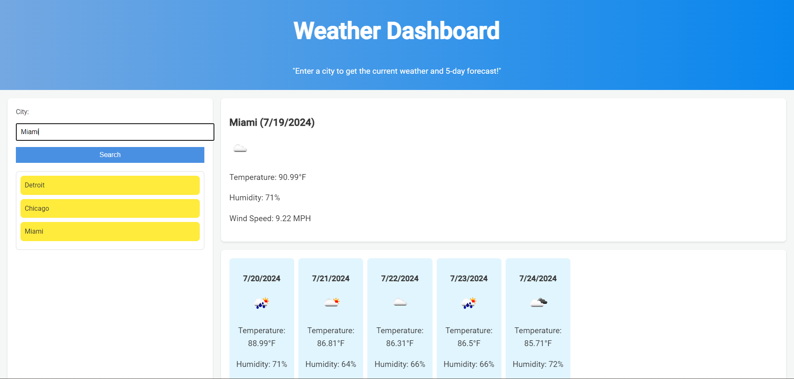

# Weather-Dashboard

## Description

Here is a 5 Day Weather Dashboard! Type in any city that you want and it will populate the 5 day forecast. It saves you recent searches in your local history and on the screen in case you want to go back to them!

- I made this to experiment with the OpenWeather API.
- This helped me understand how to use and impliment API's and use local storage.

## Usage

Here is a screenshot of the application.

## Features

Its as easy as typing in what city you want the forcast for, hit search, WHAMMY!

## Credits

Thank you to OpenWeather for providing this api. Here is a link to their homepage if you want to know more about them.
https://openweathermap.org/ 

## Contact

If you have any questions or want to see more of my work, click my github link: https://github.com/TheKyleKirby 